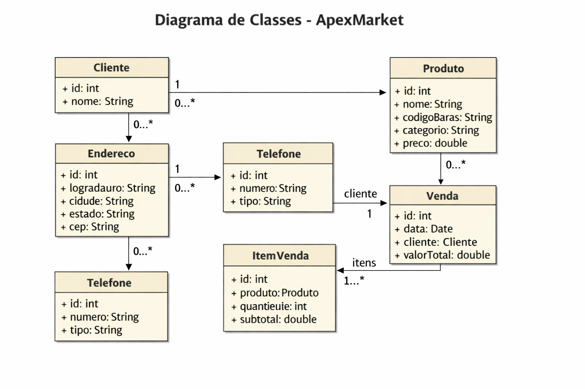
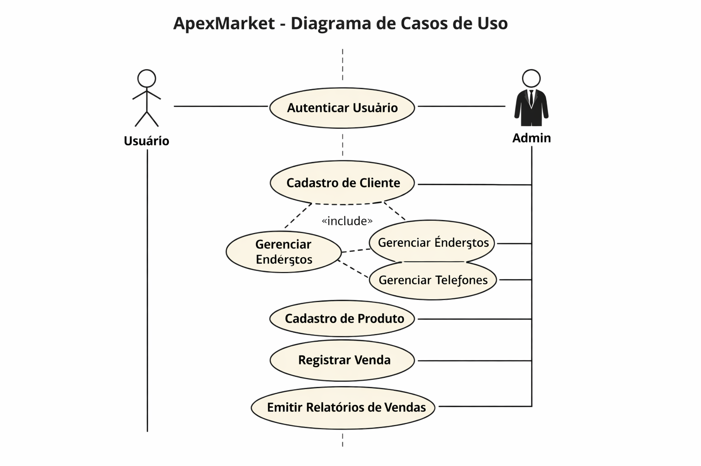
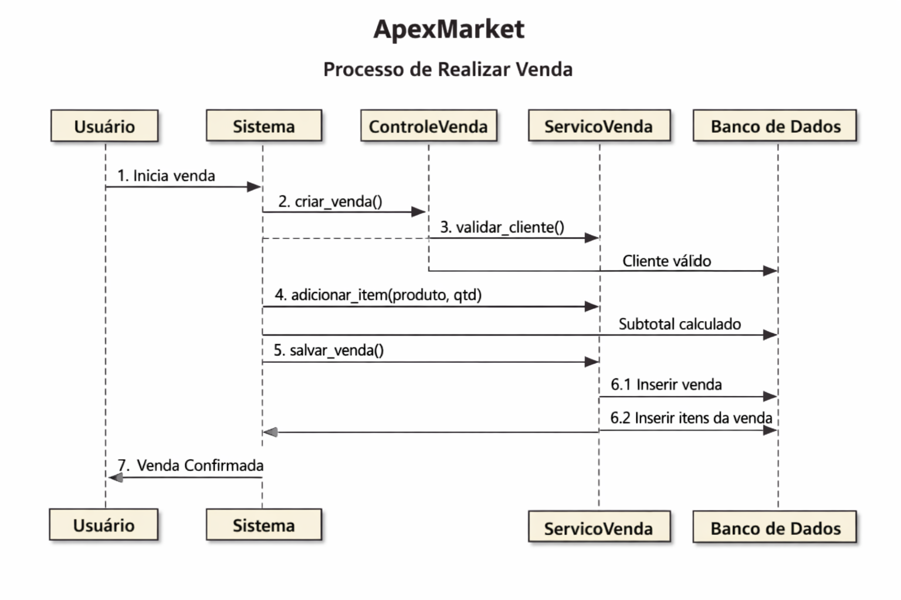

# 🏗️ Arquitetura do Projeto - ApexMarket

O **ApexMarket** é um projeto fictício e de estudo desenvolvido para praticar **programação orientada a objetos (POO)** em **Python**, utilizando **MySQL** como banco de dados.  
Este documento descreve a arquitetura geral do sistema, incluindo seus principais componentes e diagramas UML.

---

## 📘 Visão Geral

O sistema foi projetado para representar um **processo de vendas completo**, com foco em boas práticas de modelagem orientada a objetos e separação de responsabilidades entre camadas.

### 🔹 Camadas Principais

| Camada | Responsabilidade |
|--------|------------------|
| **Model** | Define as classes e entidades do domínio (Cliente, Produto, Venda, etc.) |
| **Repository** | Gerencia a persistência dos dados (CRUD com SQLAlchemy e MySQL) |
| **Service** | Contém as regras de negócio e validações |
| **Controller** | Controla a comunicação entre o usuário e o sistema (API REST) |
| **Config** | Define a conexão com o banco de dados e parâmetros globais |

---

## 🧩 Diagrama de Classes

### 📋 Descrição

O diagrama de classes representa as entidades principais do sistema e seus relacionamentos:

- **Cliente**
  - Possui múltiplos **Endereços** e **Telefones**
  - Está associado a várias **Vendas**

- **Endereco**
  - Contém informações de localização (logradouro, cidade, estado, CEP)
  - Relacionado 1:N com Cliente

- **Telefone**
  - Armazena número e tipo (celular, fixo, comercial)
  - Relacionado 1:N com Cliente

- **Produto**
  - Representa os itens disponíveis para venda (nome, categoria, preço)

- **Venda**
  - Relacionada a um Cliente e contém múltiplos **ItemVenda**

- **ItemVenda**
  - Define o produto, quantidade e subtotal de cada item da venda

---

## 🎯 Diagrama de Casos de Uso

### 📋 Descrição

O diagrama de casos de uso mostra as interações entre os **atores** e o sistema:

- **Usuário**
  - Autentica-se no sistema
  - Realiza vendas

- **Admin**
  - Gerencia clientes (endereços e telefones)
  - Cadastra produtos
  - Registra vendas
  - Emite relatórios de vendas

### 🔗 Relações
- O caso de uso **Cadastro de Cliente** inclui os casos **Gerenciar Endereços** e **Gerenciar Telefones**.
- Ambos os atores compartilham o caso **Autenticar Usuário**.

---

## 🔄 Diagrama de Sequência

### 📋 Descrição

O diagrama de sequência ilustra o fluxo do processo de **realizar uma venda**:

1. O **Usuário** inicia a venda.
2. O **Sistema** aciona o **ControleVenda**.
3. O **ControleVenda** solicita ao **ServicoVenda** a validação do cliente.
4. O **ServicoVenda** calcula subtotais e salva os dados no **Banco de Dados**.
5. O **Sistema** retorna a confirmação da venda ao usuário.

### 🔁 Interações Principais
- **Usuário → Sistema**: inicia o processo.  
- **Sistema → ControleVenda → ServicoVenda → Banco de Dados**: executa validações e persistência.  
- **Banco de Dados → Sistema → Usuário**: retorna confirmação da venda.

---

## 🧠 Conclusão

A arquitetura do **ApexMarket** foi projetada para ser **modular, escalável e didática**, permitindo o estudo de:
- Modelagem orientada a objetos
- Persistência com ORM
- Separação de camadas
- Fluxos de interação entre componentes

Este documento serve como referência para o desenvolvimento e evolução do projeto.

---

📅 **Versão:** 1.0  
👨‍💻 **Autor:** Marcelo de Souza Dias  
📚 **Tipo:** Projeto fictício e de estudo
